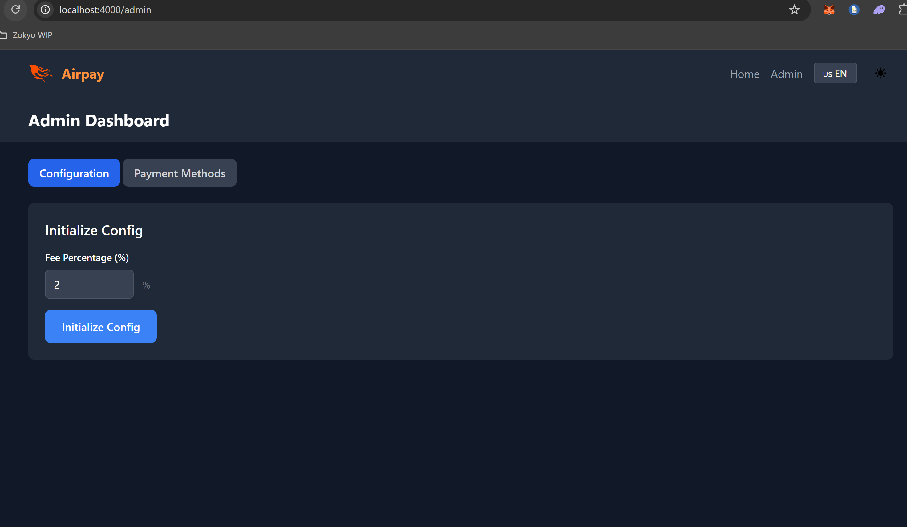

# Solana Payment Gateway


A decentralized payment gateway built on Solana blockchain that enables merchants to accept crypto payments.

## 🏗️  Project Structure

```
├── phoenix_dapp/          # Server-side rendering framework with WebSocket support
│   ├── assets/           # JavaScript hooks for Phantom wallet integration
│   └── ...
├── programs/             # Solana smart contracts (Anchor framework)
├── next-ts-dapp/        # [DEPRECATED] Failed Next.js TypeScript frontend attempt using Gill
└── ...
```

### Components Overview

- **`phoenix_dapp`**: Main web application built with Phoenix Framework, featuring server-side rendering and WebSocket connections. JavaScript hooks in the assets directory integrate with Phantom wallet as the Solana provider.

- **`programs`**: Contains the Anchor-based smart contracts that power the payment gateway functionality.


- **`next-ts-dapp`**: ⚠️ **Deprecated** - This was an experimental Next.js TypeScript frontend that failed to properly implement wallet signing functionalityutilizing Gill.


## 🎭 Program Architecture

The smart contract system involves three main actors:


### 👑 Admin
- **`initialize_config`**: Sets up the initial program configuration
- **`set_mint_as_payment`**: Whitelists token mints that can be used as payment methods
  - Here I used PDAs to make the whitelist theoritically limitless.

### 🏪 Merchant

- **`initialize_invoice_account`**: Creates a merchant account to use the payment gateway
- **`initialize_invoice_item_account`**: Creates invoices for products/services to be sold

### 👤 User (Buyer)
- **`pay_invoice_item`**: Processes payment for invoiced items

## 🚀 Getting Started

### Prerequisites


- Docker (for PostgreSQL)
- Git
- Node.js and npm/yarn

### 1. Smart Contracts (Anchor Programs)


First, install Solana and Anchor if you haven't already:


```bash

# Install Solana CLI
sh -c "$(curl -sSfL https://release.solana.com/v1.16.0/install)"

# Install Anchor
npm install -g @coral-xyz/anchor-cli
```

Build and test the smart contracts:

```bash
# Build the programs
anchor build

# Run tests
anchor test
```

#### Surfpool Configuration

This project includes Surfpool configuration for local Solana development:


```bash
# Start local Solana validator with Surfpool
surfpool start
```

### 2. Phoenix Web Application

#### Install Elixir on Linux

```bash
# Ubuntu/Debian
sudo add-apt-repository ppa:rabbitmq/rabbitmq-erlang
sudo apt update
sudo apt install elixir erlang 
```

#### Database Setup


Start PostgreSQL using Docker:

```bash

docker run --name postgres_db \
  -e POSTGRES_USER=postgres \

  -e POSTGRES_PASSWORD=postgres \
  -p 5432:5432 \
  -d postgres
```

#### Run Phoenix Application


```bash
# Navigate to phoenix app directory
cd phoenix_dapp


# Install dependencies
mix deps.get


# Create database (after PostgreSQL container is running)
mix ecto.create

# Start Phoenix server
mix phx.server
```


The application will be available running at `http://localhost:4000`

### 3. Frontend Usage 

1. Ensure you have [Phantom Wallet](https://phantom.app/) installed in your browser.
2. Make sure Surfpool is running (`surfpool start`) at project root.
3. Open and connect your Phantom wallet to **localhost/localnet**.
4. Navigate to `http://localhost:4000` and connect your wallet.


## 📝 Usage Scenario

1. **Admin Setup**: Initialize the program configuration and whitelist payment tokens
2. **Merchant Onboarding**: Create merchant accounts and invoice items
3. **Customer Payments**: Users can browse and pay for items using whitelisted tokens


---

*Built with ❤️ using Solana, Anchor, and Phoenix Framework*


